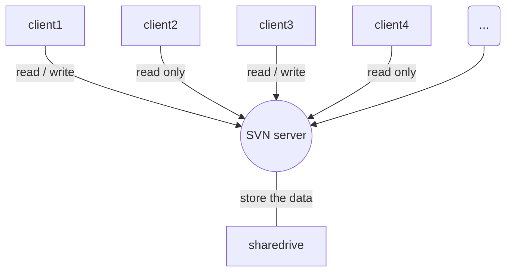

# todo list {: #td_list }
* 整理[markdown语法](https://zh.mweb.im/markdown.html)
* 整理[mkdocs语法](https://mkdocs.org)
* 整理[supervisor语法](https://www.cnblogs.com/zhoujinyi/p/6073705.html)
* 整理Python
    * [six.py](https://www.jianshu.com/p/62a6e3f2d1ca)
    


The HTML specification 
is maintained by the W3C.

*[HTML]: Hyper Text Markup Language 
*[W3C]: World Wide Web Consortium


!!! type "optional explicit title within double quotes"
    Any number of other indented markdown elements.

    This is the second paragraph.
    
!!! note
    this is note
    
!!! danger "Don't try this at home"
    ...
    
!!! attention "attention"
    attention
    
!!! caution "caution"
    caution
    
!!! error "error"
    error
    
!!! danger "danger"
    danger
    
!!! hint "hint"
    hint
    
!!! important "important"
    important
    
!!! note "note"
    note
    
!!! tip "tip"
    tip
    
!!! warning "warning"
    warning
    
!!! unknown "unknown"
    ...
    
:command:`supervisord` Command-Line Options

只有一个h1<br/>
h2并列关系，尽量不加序号<br/>
h3~h6 有顺序的可以加序号，没有顺序关系的也尽量不加序号<br/>
h3 1. 2. 3. <br/>
h4 (1) (2) (3) <br/>
h5 a. b. c. <br/>
h6 ①

▍这个加在分级标题前效果好<br/>
▏这个在段落前等于是空格各种三角 ▷ ◁ ▶ ◀ △▽▲▼<br/>
➥ 和 → 还有 ˉˉ↴ 以及 ➨ 起引导视线的作用<br/>
☛ 这个是点击<br/>
☑ 和 ✔ 是已经选择，OK<br/>
✘ 是错误，删除，NO<br/>
✄ 是剪切<br/>
❐ 这个是复制粘贴<br/>
✚ 是添加，补充，选项<br/>
☷ 是列表，调整格式<br/>
① ② ③ ④ ⑤ ⑥ ⑦ ⑧ ⑨ ⑩ 这样的数字是不是很酷<br/>
罗马数字（Ⅰ·Ⅱ·Ⅲ·Ⅳ·Ⅴ·Ⅵ·Ⅶ·Ⅷ·Ⅸ·Ⅹ·Ⅺ·Ⅻ）比较优雅复古

```flow
st=>start: Start:>http://www.google.com[blank]
e=>end:>http://www.google.com
op1=>operation: My Operation
sub1=>subroutine: My Subroutine
cond=>condition: Yes
or No?:>http://www.google.com
io=>inputoutput: catch something...
st->op1->cond
cond(yes)->io->e
cond(no)->sub1(right)->op1
```

```sequence
Title: Here is a title
A->B: Normal line
B-->C: Dashed line
C->>D: Open arrow
D-->>A: Dashed open arrow
```



```mermaid
graph TD
    subgraph Request
    Request
    end

    subgraph Views
    Views
    end
    
    subgraph Helper
    Helper
    end
    
    subgraph Objects
    Objects
    end
    
    subgraph Model
    Model
    end
    
    subgraph Cache
    Cache
    end
    
    Request-->|route请求通过路由到达视图|Views
```

```sequence
Title: 业务逻辑的架构
Request->Views: route
Views->Helper: call
Helper->Objects: operate
Objects-->Model: read/write
Objects-->Cache: read/write
Model-->Objects: return
Cache-->Objects: return
Objects-->Helper: return
Helper-->Views: return
Views-->Response: return
```

单进程单线程（处理业务慢） -> 多进程多线程（并发问题）<br/>
1、只有一个进程（组）专门负责写数据库（如果是进程组，每个进程都是写不同的数据库/不同的表）<br/>
负责业务的进程（组）把需要写进数据库的数据放进队列，这边的进程（组）从队列读取，并写数据库<br/>
优点：不加锁，异步写保证成功<br/>
缺点：只能异步，无法获取返回值。不适合需要读+写的场景（需要等待它的返回值，再做其他操作的场景）<br/>
适合：统计方面，如：登录人数，我只要通知他登录次数+1就可以了，不用管加之前/之后的值具体是多少<br/>
不适合：如：支付，支付前需要判断余额是否够，支付后需要知道扣费是否成功<br/>
2、根据ID路由到某个进程<br/>
优点：不加锁，能够同步操作，可以随意读写，不会有并发问题<br/>
缺点：只能操作一个表<br/>
如：修改用户信息，按用户ID路由到某个进程<br/>

3、加锁
4、原子操作

