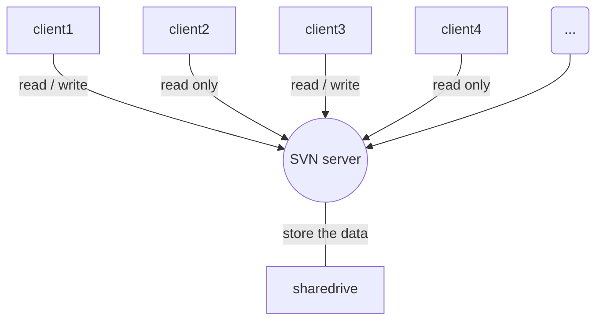

# todo list {: #td_list }
* 整理[markdown语法](https://zh.mweb.im/markdown.html)
* 整理[mkdocs语法](https://mkdocs.org)
* 整理[supervisor语法](https://www.cnblogs.com/zhoujinyi/p/6073705.html)
* 整理Python
    * [six.py](https://www.jianshu.com/p/62a6e3f2d1ca)
    


The HTML specification 
is maintained by the W3C.

*[HTML]: Hyper Text Markup Language 
*[W3C]: World Wide Web Consortium


代码规范：<br/>
首先，业务逻辑应该保持一致性，原子性，要么全部成功，要么全部失败并回滚。这里的失败包括出现异常或非法的逻辑。<br/>
例如：取款操作。由于账户余额不足导致的取款失败，算是业务成功，属于正常的业务逻辑。<br/>
只有出现报错(例如金额中有英文字母)，或是本来必定会存在的订单号，不存在了(非法的业务逻辑)，才算是业务失败<br/>

应该进入业务逻辑之前打开事务，在业务逻辑结束之后，中途出现异常 或 非法的业务逻辑，都要全部回滚，否则，都全部提交。<br/>
操作记录、消息发送、业务逻辑等，都应该相互独立，互不干扰<br/>
即，业务失败，也要记录操作、并发送消息；记录操作出错，而导致的成功的业务回滚，或不发送消息，也是不行的；发送消息失败，也不能回滚了已经成功的业务，或不记录操作；<br/>

记录的"修改个人信息"的记录，由于消息记录模块和修改信息这一业务模块要分离，所以会出现：修改前、修改时、修改后都分别在数据库中读取用户信息<br/>
但实际上，我们只需要读一次数据库。<br/>
解决办法就是，在最开始的时候，查出用户信息，并设为全局变量。然后，记录下修改前的信息、修改信息、记录下修改后的信息，都不需要额外的读数据库<br/>

```
:::python
@gen_global_val
@auto_record_operate
def func(*args, **kwargs):
    # 修改用户信息
    user = global.user
    # user.update(xx)
    return

def gen_global_val(func):
    def wrapper(*args, **kwargs):
        request = args[0] if args else kwargs['request']
        uid = request.GET.get('uid')
        if not uid:
            return
        
        global.user = get_user(uid)
        return func(*args, **kwargs)
    return wrapper

def auto_record_operate(func):
    def wrapper(*args, **kwargs):
        before_data = global.user
        rst = func(*args, **kwargs)
        after_data = global.user
        insert_record(global.user.uid, before_data, after_data)
        return rst
```

!!! type "optional explicit title within double quotes"
    Any number of other indented markdown elements.

    This is the second paragraph.
    
!!! note
    this is note
    
!!! danger "Don't try this at home"
    ...
    
!!! attention "attention"
    attention
    
!!! caution "caution"
    caution
    
!!! error "error"
    error
    
!!! danger "danger"
    danger
    
!!! hint "hint"
    hint
    
!!! important "important"
    important
    
!!! note "note"
    note
    
!!! tip "tip"
    tip
    
!!! warning "warning"
    warning
    
!!! unknown "unknown"
    ...
    
:command:`supervisord` Command-Line Options

只有一个h1<br/>
h2并列关系，尽量不加序号<br/>
h3~h6 有顺序的可以加序号，没有顺序关系的也尽量不加序号<br/>
h3 1. 2. 3. <br/>
h4 (1) (2) (3) <br/>
h5 a. b. c. <br/>
h6 ①

▍这个加在分级标题前效果好<br/>
▏这个在段落前等于是空格各种三角 ▷ ◁ ▶ ◀ △▽▲▼<br/>
➥ 和 → 还有 ˉˉ↴ 以及 ➨ 起引导视线的作用<br/>
☛ 这个是点击<br/>
☑ 和 ✔ 是已经选择，OK<br/>
✘ 是错误，删除，NO<br/>
✄ 是剪切<br/>
❐ 这个是复制粘贴<br/>
✚ 是添加，补充，选项<br/>
☷ 是列表，调整格式<br/>
① ② ③ ④ ⑤ ⑥ ⑦ ⑧ ⑨ ⑩ 这样的数字是不是很酷<br/>
罗马数字（Ⅰ·Ⅱ·Ⅲ·Ⅳ·Ⅴ·Ⅵ·Ⅶ·Ⅷ·Ⅸ·Ⅹ·Ⅺ·Ⅻ）比较优雅复古

```flow
st=>start: Start:>http://www.google.com[blank]
e=>end:>http://www.google.com
op1=>operation: My Operation
sub1=>subroutine: My Subroutine
cond=>condition: Yes
or No?:>http://www.google.com
io=>inputoutput: catch something...
st->op1->cond
cond(yes)->io->e
cond(no)->sub1(right)->op1
```

```sequence
Title: Here is a title
A->B: Normal line
B-->C: Dashed line
C->>D: Open arrow
D-->>A: Dashed open arrow
```



```mermaid
graph TD
    subgraph Request
    Request
    end

    subgraph Views
    Views
    end
    
    subgraph Helper
    Helper
    end
    
    subgraph Objects
    Objects
    end
    
    subgraph Model
    Model
    end
    
    subgraph Cache
    Cache
    end
    
    Request-->|route请求通过路由到达视图|Views
```

```sequence
Title: 业务逻辑的架构
Request->Views: route
Views->Helper: call
Helper->Objects: operate
Objects-->Model: read/write
Objects-->Cache: read/write
Model-->Objects: return
Cache-->Objects: return
Objects-->Helper: return
Helper-->Views: return
Views-->Response: return
```
Note right of Request: 请求经过路由发送到对应的Views
Note right of Views: Views只根据主逻辑调用Helper
Note right of Helper: Helper可以有很多层：最底层的Helper逻辑简单，对接Objects，操作对象；最上层的Helper逻辑复杂，对接Views，隐藏细节

需求：记录用户的国旗<br/>
代码：<br/>
```
:::python
class UserInfo(models.Model):
    user_id = 
    flag = 
    
# 然后代码里面在很多的地方调用了这个 user.flag
```

需求：用户可以隐藏国旗，但是管理员后台，始终显示国旗，不隐藏<br/>
代码：<br/>
```
:::python
class UserInfo(models.Model):
    user_id = 
    flag =
    is_hide_flag = 
    
# 然后所有使用了 user.flag 的地方都要再做 if user.is_hide_flag 判断
```

更好的代码：<br/>
```
:::python
# models.py
# 这是数据库表
class UserInfo(models.Model):
    user_id = 
    flag = 
    is_hide_flag =

# user_info.py 
# 这是抽象出来的对象
class UserInfoObj(object):
    def __init__(self, user_id):
        self._obj = UserInfo.get(user_id)

    @property
    flag_never_hide(self):
        """永不隐藏的国旗，管理员后台用这个"""
        return self._obj.flag
        
    @property
    flag_auto(self):
        """自动的国旗，根据用户设置来决定是否显示，一般情况下使用这个"""
        return self._obj.flag if not self._obj.is_hide_flag else ""
        
    @property
    flag(self):
        """
        默认的国旗设置，可以返回 flag_never_hide 或 flag_auto
        如：原来的代码10个地方使用user.flag，修改后8个地方要user.flag_auto，只有2个地方要user.flag_never_hide
        那这里就 return self.flag_auto 然后把那2个地方手动改成 user.flag_never_hide
        反过来：原来的代码10个地方使用user.flag，修改后2个地方要user.flag_auto，8个地方要user.flag_never_hide
        那这里就 return self.flag_never_hide 然后把那2个地方手动改成 user.flag_auto
        """
        # return self._obj.flag  这行是改需求之前的代码
        return self.flag_auto
```

单进程单线程（处理业务慢） -> 多进程多线程（并发问题）<br/>
1、只有一个进程（组）专门负责写数据库（如果是进程组，每个进程都是写不同的数据库/不同的表）<br/>
负责业务的进程（组）把需要写进数据库的数据放进队列，这边的进程（组）从队列读取，并写数据库<br/>
优点：不加锁，异步写保证成功<br/>
缺点：只能异步，无法获取返回值。不适合需要读+写的场景（需要等待它的返回值，再做其他操作的场景）<br/>
适合：统计方面，如：登录人数，我只要通知他登录次数+1就可以了，不用管加之前/之后的值具体是多少<br/>
不适合：如：支付，支付前需要判断余额是否够，支付后需要知道扣费是否成功<br/>
2、根据ID路由到某个进程<br/>
优点：不加锁，能够同步操作，可以随意读写，不会有并发问题<br/>
缺点：只能操作一个表<br/>
如：修改用户信息，按用户ID路由到某个进程<br/>

3、加锁
4、原子操作

