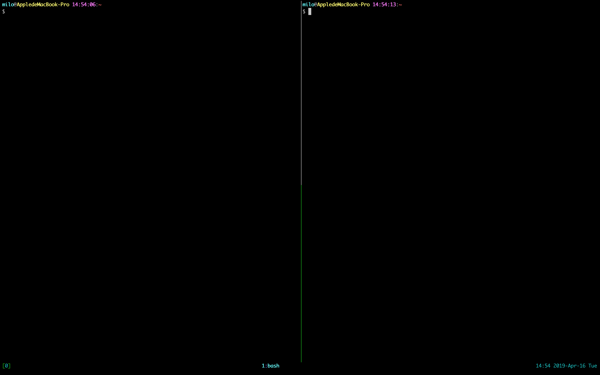
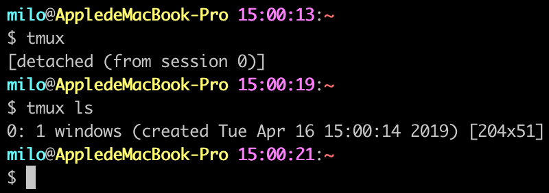

author: milo
title: Tmux

# Tmux

## 简介
Tmux 是一个终端复用工具。可以在一个终端窗口上创建、访问、控制多个终端会话。<br/>
Tmux 可以创建多个 ***会话(session)***，每个会话包含一个或多个 ***窗口(window)***，每个窗口可以分割成一个或多个 ***面板(pane)***。<br/>
所有会话都会保存在 Tmux 服务器中，每个客户端都可以连接到任意一个会话并在屏幕上展示。<br/>
服务器和每个客户端都是单独的进程，它们通过 /tmp 目录下的套接字文件进行通信。<br/>

在操作的过程中，无论客户端由于任何原因而断开了连接，只要服务器和会话没有关闭，都可以重新连接到之前的会话，继续进行未完成的操作。<br/>
另外，我们还可以同时连接到同一个会话上，实现实时地共享屏幕。<br/>

## 安装
#### Mac OS
```
:::bash
brew install tmux
```

#### Ubuntu
```
:::bash
sudo apt-get install tmux
```

▍安装完成之后，简单的使用一下<br/>

1. 在终端输入命令 `tmux` 就可以创建一个新的会话并连接到这个会话<br/>
2. 按下 `Ctrl+b`，再按下 `%`，可以看到当前面板被平分成左右两块<br/>

3. 按下 `Ctrl+b`，再按下方向键，可以在两个面板之间来回切换<br/>
4. 按下 `Ctrl+b`，再按下`d`，就会脱离当前会话，回到终端<br/>
5. 在终端内输入 `tmux ls`，可以查看当前 Tmux 服务器下的所有会话<br/>

6. 在终端内输入 `tmux a`，可以重新连接到刚才脱离的会话中<br/>

## 按键绑定
在一个已连接的客户端内，可以使用组合键来控制 Tmux。组合键由一个前缀键和一个命令键组成，前缀键默认是 `C-b (Ctrl-b)`<br/>

以下是常用的 Tmux 的默认命令键<br/>

<table>
    <tbody>
        <tr>
            <td colspan="2">Ctrl + b</td>
            <td>激活控制台；此时以下按键生效</td>
        </tr>
        <tr>
            <td rowspan="9">系统操作</td>
            <td>?</td>
            <td>列出所有快捷键；按q返回
        </tr>
        <tr>
            <td>d</td>
            <td>脱离当前会话；这样可以暂时返回Shell界面，输入tmux attach能够重新进入之前的会话</td>
        </tr>
        <tr>
            <td>D</td>
            <td>选择要脱离的会话；在同时开启了多个会话时使用</td>
        </tr>
        <tr>
            <td>Ctrl+z</td>
            <td>挂起当前会话</td>
        </tr>
        <tr>
            <td>r</td>
            <td>强制重绘未脱离的会话</td>
        </tr>
        <tr>
            <td>s</td>
            <td>选择并切换会话；在同时开启了多个会话时使用</td>
        </tr>
        <tr>
            <td>:</td>
            <td>进入命令行模式；此时可以输入支持的命令，例如kill-server可以关闭服务器</td>
        </tr>
        <tr>
            <td>[</td>
            <td>进入复制模式；此时的操作与vi/emacs相同，按q/Esc退出</td>
        </tr>
        <tr>
            <td>~</td>
            <td>列出提示信息缓存；其中包含了之前tmux返回的各种提示信息</td>
        </tr>
        <tr>
            <td rowspan="10">窗口操作</td>
            <td>c</td>
            <td>创建新窗口</td>
        </tr>
        <tr>
            <td>&</td>
            <td>关闭当前窗口</td>
        </tr>
        <tr>
            <td>数字键</td>
            <td>切换至指定窗口</td>
        </tr>
        <tr>
            <td>p</td>
            <td>切换至上一窗口</td>
        </tr>
        <tr>
            <td>n</td>
            <td>切换至下一窗口</td>
        </tr>
        <tr>
            <td>l</td>
            <td>在前后两个窗口间互相切换</td>
        </tr>
        <tr>
            <td>w</td>
            <td>通过窗口列表切换窗口</td>
        </tr>
        <tr>
            <td>,</td>
            <td>重命名当前窗口；这样便于识别</td>
        </tr>
        <tr>
            <td>.</td>
            <td>修改当前窗口编号；相当于窗口重新排序</td>
        </tr>
        <tr>
            <td>f</td>
            <td>在所有窗口中查找指定文本</td>
        </tr>
        <tr>
            <td rowspan="14">面板操作</td>
            <td>”</td>
            <td>将当前面板平分为上下两块</td>
        </tr>
        <tr>
            <td>%</td>
            <td>将当前面板平分为左右两块</td>
        </tr>
        <tr>
            <td>x</td>
            <td>关闭当前面板</td>
        </tr>
        <tr>
            <td>!</td>
            <td>将当前面板置于新窗口；即新建一个窗口，其中仅包含当前面板</td>
        </tr>
        <tr>
            <td>Ctrl+方向键</td>
            <td>以1个单元格为单位移动边缘以调整当前面板大小</td>
        </tr>
        <tr>
            <td>Alt+方向键</td>
            <td>以5个单元格为单位移动边缘以调整当前面板大小</td>
        </tr>
        <tr>
            <td>Space</td>
            <td>在预置的面板布局中循环切换；依次包括even-horizontal、even-vertical、main-horizontal、main-vertical、tiled</td>
        </tr>
        <tr>
            <td>q</td>
            <td>显示面板编号</td>
        </tr>
        <tr>
            <td>o</td>
            <td>在当前窗口中选择下一面板</td>
        </tr>
        <tr>
            <td>方向键</td>
            <td>移动光标以选择面板</td>
        </tr>
        <tr>
            <td>{</td>
            <td>向前置换当前面板</td>
        </tr>
        <tr>
            <td>}</td>
            <td>向后置换当前面板</td>
        </tr>
        <tr>
            <td>Alt+o</td>
            <td>逆时针旋转当前窗口的面板</td>
        </tr>
        <tr>
            <td>Ctrl+o</td>
            <td>顺时针旋转当前窗口的面板</td>
        </tr>
    </tbody>
</table>

**按键绑定可以通过 `bind-key` 和 `unbind-key` 命令来修改（前缀键和命令键都可以修改）**<br/>

## 命令
常用命令：<br/>

Command | alias | function
---|---|---
attach-session | attach | 连接会话
source-file | source | 执行指定文件中的所有命令
list-commands | lscm | 列出所有的命令
list-sessions | ls | 列出所有的会话
detach-client | detach | 客户端脱离会话（默认是当前客户端脱离）
bind-key | bind | 按键绑定
list-keys | lsk | 列出所有已经绑定的按键
send-keys | send | 发送按键
unbind-key | unbind | 解除按键绑定
set-option | set | 设置会话选项
set-window-option | setw | 设置窗口选项
show-options | show | 展示会话选项
show-window-options | showw | 展示窗口选项 

## 配置文件
通常，Tmux 服务器会在第一个会话创建的时候自动启动，在最后一个会话结束时自动关闭。<br/>
当 Tmux 服务器启动时，会执行 `~/.tmux.conf` 中的命令。<br/>
把配置写入 `~/.tmux.conf` 文件中，Tmux 服务器启动时自动执行文件中的命令，完成配置。<br/>

以下是我的配置：<br/>
```
set-option -g default-terminal "screen"
set-option -g display-time 3000
set-option -g history-limit 65535

# copy-mode 将快捷键设置为 vi 模式
set-window-option -g mode-keys vi

# 窗口的初始序号；默认为0，这里设置为1
set-option -g base-index 1
# 提示信息的持续时间；设置足够的时间以避免看不清提示，单位为毫秒
set-option -g display-time 5000
# 控制台激活后的持续时间；设置合适的时间以避免每次操作都要先激活控制台，单位为毫秒
set-option -g repeat-time 1000
# 操作状态栏时的默认键盘布局；可以设置为vi或emacs
set-option -g status-keys vi

# 如果你开了多个窗口，可能想当别的窗口发生什么的时候你能收到通知
set-window-option -g monitor-activity on
set-option -g visual-activity on

# 状态栏
# 颜色
set-option -g status-style bg=black
# 对齐方式
set-option -g status-justify centre
# 左下角
set-option -g status-left '#[bg=black,fg=green][#[fg=cyan]#S#[fg=green]]'
set-option -g status-left-length 20
# 窗口列表
set-window-option -g automatic-rename on
set-window-option -g window-status-format '#[dim]#I:#[default]#W#[fg=grey,dim]'
set-window-option -g window-status-current-format '#[fg=cyan,bold]#I#[fg=blue]:#[fg=cyan]#W#[fg=dim]'
# 右下角
set-option -g status-right '#[fg=green]#[fg=cyan]%H:%M %Y-%b-%d %a#[fg=green]'

# 支持鼠标
set-option -g mouse on

# 更改prefix键
set-option -g prefix C-x
unbind-key C-b
bind-key C-x send-prefix

# 支持vi模式来切换pane
# up
bind-key k select-pane -U
# down
bind-key j select-pane -D
# left
bind-key h select-pane -L
# right
bind-key l select-pane -R
```
